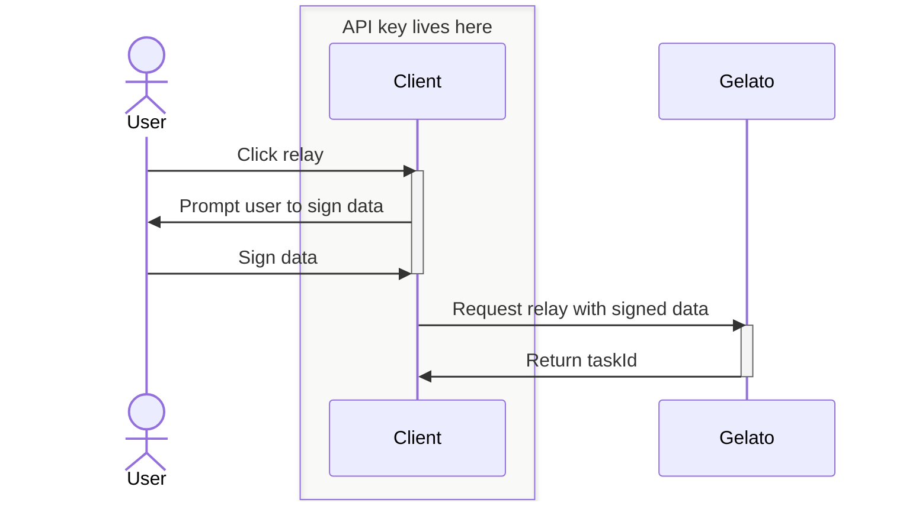
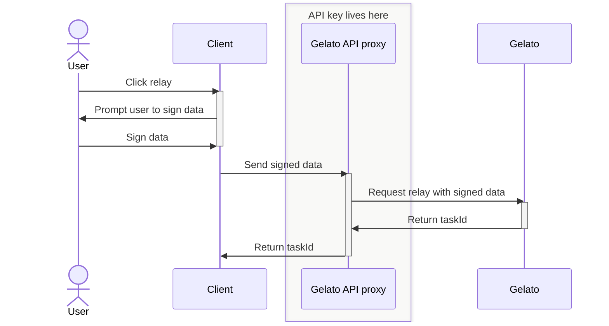

<h1 align="center">Reservoir Gelato Wallet Adapter</h1>

## Installation

```
pnpm install @reservoir0x/gelato-adapter @reservoir0x/reservoir-sdk
```

Also make sure to install the peer dependencies required by the adapter if your application doesn't already include them:

```
pnpm install ethers viem @reservoir0x/reservoir-sdk
```

## Usage

There are two ways to use this adapter: with a Gelato API key or a Gelato API proxy URL.

If you are relaying transactions for a public protocol like Seaport, you might prefer to use the Gelato SDK on the backend to not expose your API keys as these will give anyone the power to relay their transactions. In this case, you should use the Gelato API proxy URL parameter. You will have to build your own backend API proxy, there is a basic example [here](/sdk-demo/app/api/relay/route.ts).

Otherwise, if you are relaying transactions and don't mind your API keys being public, you can pass the Gelato API keys into the adapter directly on the front-end.

To use the adapter pass in your ethers signer and Gelato API key / Gelato API proxy URL. In return receive a normalized ReservoirWallet object:

### Gelato API key

<h4>Sequence Diagram</h4>



<h4>Example adapter integration</h4>

```typescript
import { getClient } from '@reservoir0x/reservoir-sdk'
import { adaptGelatoRelayer } from '@reservoir0x/gelato-adapter'
import { useSigner } from 'wagmi'

...

const { data: signer } = useSigner()
const wallet = adaptGelatoRelayer(signer, GELATO_API_KEY)

getClient().actions.buyToken({
  items: [
    {
      collection: '0xbc4ca0eda7647a8ab7c2061c2e118a18a936f13d',
    },
  ],
  options: {
    usePermit: true,
    currency: '0x07865c6e87b9f70255377e024ace6630c1eaa37f', //GOERLI USDC
  },
  wallet,
  onProgress: () => {},
})
```

### Gelato API proxy URL

You will have to build your own backend API proxy, there is a basic example [here](/sdk-demo/app/api/relay/route.ts).

<h4>Sequence Diagram</h4>



<h4>Example adapter integration</h4>

```typescript
import { getClient } from '@reservoir0x/reservoir-sdk'
import { adaptGelatoRelayer } from '@reservoir0x/gelato-adapter'
import { useSigner } from 'wagmi'

...

const { data: signer } = useSigner()
const apiProxyUrl = "/api/relay"
const wallet = adaptGelatoRelayer(signer, undefined, apiProxyUrl)

getClient().actions.buyToken({
  items: [
    {
      collection: '0xd8560c88d1dc85f9ed05b25878e366c49b68bef9',
    },
  ],
  options: {
    usePermit: true,
    currency: '0x07865c6e87b9f70255377e024ace6630c1eaa37f',
  },
  wallet,
  onProgress: () => {},
})
```

In the code snippets above we use the wagmi `useSigner` method, which is not required, you can create your ethers signer however you wish. We then adapt the signer to the ReservoirWallet object and pass this into any of the SDK methods. Here we pass it into the buyToken method along with the other required parameters. In order for the purchase to be successful you'll need the following:

- Configure your gelato application to whitelist Reservoir's [PermitProxy](https://github.com/reservoirprotocol/indexer/blob/b82284e67c9995f39d8274a93e73e61bd08fa6a3/packages/contracts/deployments.json#L260).
- Pass usePermit: true to make the API return calldata that routes to the permit proxy
- Make sure the erc20 used for purchase supports permit (USDC, etc)
